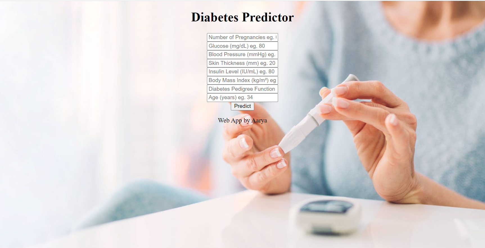

## Diabetes-predictor

Diabetes, is a group of metabolic disorders in which there are high blood sugar levels over a prolonged period. Symptoms of high blood sugar include frequent urination, increased thirst, and increased hunger. If left untreated, diabetes can cause many complications. Acute complications can include diabetic ketoacidosis, hyperosmolar hyperglycemic state, or death. Serious long-term complications include cardiovascular disease, stroke, chronic kidney disease, foot ulcers, and damage to the eyes. 

- The objective of this project was to predict diabetes based on selected features. Dataset is trained using various Machine Learning models. And finally a web app is created using Flask which takes user input for result prediction.

## Data Description

This dataset is originally from the National Institute of Diabetes and Digestive and Kidney Diseases. The objective of the dataset is to diagnostically predict whether or not a patient has diabetes, based on certain diagnostic measurements included in the dataset. In particular, all patients here are females at least 21 years old of Pima Indian heritage.

> You can download the dataset here - (https://www.kaggle.com/uciml/pima-indians-diabetes-database/download)

## **Web App**

